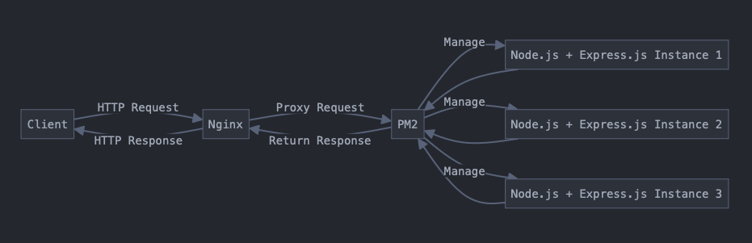

1. instance 的 public IP：

   - `EC2 Public IP: 13.55.58.188`

2. Instance type 是 AWS EC2 提供的不同規格的虛擬機配置。
   例如：t2.micro (1 vCPU, 1 GiB RAM) 適合低流量網站。

3. Nginx：

   - 高性能 web server
   - 可作為 Reverse Proxy 和 Load Balancer
   - 處理靜態文件效率高
   - 支持 HTTPS
     例如：可以用 Nginx 部署多個網站在同一台伺服器上，如 `site1.example.com` 和 `site2.example.com`。

4. pm2：

   - Node.js 的 process manager
   - 可保持應用持續運行
   - 提供負載平衡和監控功能
     例如：`pm2 start app.js -i max` 可以根據 CPU 核心數啟動多個 instance。

5. Nginx proxy 到 Express：

   - 使用反向代理（Reverse proxy）
   - 增加安全性
   - 靜態文件處理更高效
     例如：Nginx 監聽 80 port，將請求轉發到運行在 3000 port 的 Express app。

   

6. Nginx 設定檔：

   ```nginx
   server {
       listen 80;
       server_name example.com;

       location / {
           proxy_pass http://localhost:3000;
           proxy_http_version 1.1;
           proxy_set_header Upgrade $http_upgrade;
           proxy_set_header Connection 'upgrade';
           proxy_set_header Host $host;
           proxy_cache_bypass $http_upgrade;
       }
   }
   ```

7. Security Group：

   - AWS 的虛擬防火牆
   - 控制 EC2 instance 的網路流量
   - 依最小權限原則設定
     例如：只開放 80 (HTTP), 443 (HTTPS), 22 (SSH) ports。

8. sudo：

   - 用於執行需要管理員權限的命令
   - 系統級操作通常需要 sudo
     例如：`sudo apt update` 用於更新系統 package list。

9. Nginx log：

   - 位置：`/var/log/nginx/`
   - 主要檔案：access.log, error.log
   - 查看方式：`sudo tail -f /var/log/nginx/access.log`
     例如：可以看到類似 `192.168.1.1 - - [10/Oct/2023:13:55:36 +0000] "GET / HTTP/1.1" 200 2785` 的日誌條目。

10. 無

11. 參考資料：
    - AWS document, Claude 3.5 Sonnet
